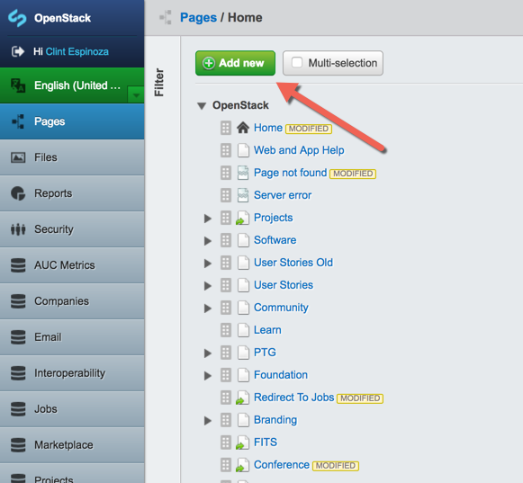
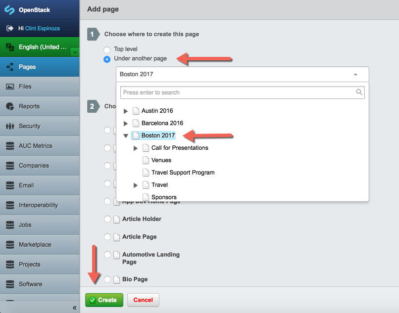
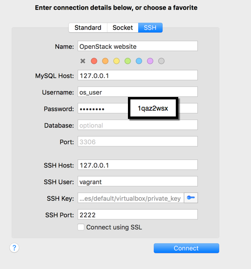

## **Publishing a new web page to OpenStack website**
<br>

Publishing a new web page will involve four basic steps that are detailed in this document:

1. Updating your local version of the remote OpenStackweb repository with Git

1. Creating your work - html and css files, etc.

1. Pushing your work to the remote repository with Git

1. Publishing your work through the Silverstripe Content Management System


### **Start with a fresh OpenStack web Development Environment and work from a feature branch in Git**

It is a best practice to set up your Git environment to avoid merge commits.   This can easily be done with Git by running the following command to set up auto rebase.

	$ git config --global branch.autosetuprebase always

You will work in a feature branch in Git taken off of the production branch.  The production branch contains the latest code that is approved and reflects the public OpenStack website.  

In Git, follow these steps to create your branch:

	$ git checkout production

	$ git pull --rebase origin production

	$ git checkout -b "your-named-branch"

Now you are ready to complete your work.  You will revisit Git - for this repository - when your work is complete.

****Note on quick fixes on the master branch:**

If you are making a quick change to an existing page or any other minor changes you will want to work from the master branch.  This is outlined later in a summary section called "WORKING FROM THE MASTER BRANCH".

### **Create your web page**

The OpenStack website environment utilizes the SilverStripe framework and Content Management System (CMS) and your html documents will be saved in a Silverstripe file.  

Place your html work in a Silverstripe .ss (instead of .html) file, named to reflect the content of your page (YourFile.ss), at the following location:

**openstack-org/themes/openstack/templates/Layout/YourFile.ss**

Or, if your file is related to the Summit, at this location:

**openstack-org/Summit/templates/Layout/YourFile.ss**

#### **Adding images for your site**

You can place public domain images in an images folder along with your commits to the repo.

If you are adding images to your site that are covered by trademark or copyright, you will need to put them in the private assets repository. 

This is a separate repository that you should clone to your site root.  You will need to create a symbolic link from your local development environment into your virtual machine (VM), so that the VM can access these files. Follow these steps from your site root.

First, clone the private assets repository:

	$ git clone https://github.com/OpenStackweb/openstackwebsite-assets private-assets

Next, you will need to access your VM:

	$ vagrant ssh

Next, within your VM, navigate to the appropriate folder to create the symbolic link:

	$ cd /var/www/local.openstack.org

Create the symlink:

	$ ln -s /var/www/local.openstack.org/private-assets/themes/openstack/images /var/www/local.openstack.org/themes/openstack/images

Then, you will add your images, not on the VM, but on your local development environment here:

	private-assets/themes/openstack/images

When you are finished, you will need to save, commit, and push your commit to the private assets repo.  Remember that this is a separate repository from your OpenStackweb development environment and will require separate Git actions.

### **Push your work to the OpenStackweb Github repository.**

After work completion, add all of your files to the git repository on your local machine.   You should still be on your feature branch.

	$ git add *

Commit your work to your repository with the following command:

	$ git commit -m "[username] - #issue_number - a message that describes what you did"

where username is your user name and #issue_number is the chili ticket number related to your project.

**Rebase and push to production**

Next, you will need to do a Rebase.  This will reset your repository head to match that of the remote repository on Github and add your work on top of that:

	$ git pull --rebase origin production

And finally, if there are no conflicts:

	$ git push origin "your-named-branch"

Then, you will do a Pull Request on Github so that your branch is merged into production

**Squashed Commits**

If you have made several small commits, it is important to squash all of them into one single commit before pushing to the OpenStackweb repository.

	$ git rebase -i HEAD~N 

where N is the number of commits you have made, plus one

This will open your editor and will list your commits with the word "pick" at the beginning of each one.  Change “pick” to “squash” for each commit that you want to squash and keep “pick” for the commit you would like to submit.  This would most likely be the first commit that describes your project. Save and close the file and now you are ready to push to the remote repository.

**Note:** if you run into conflicts while running the rebase, quit the rebase:

	$ git rebase --abort

Then, fix the conflicts with a file comparison tool such as Meld ([http://meldmerge.org/](http://meldmerge.org/)) and run the rebase again.

**WORKING FROM THE MASTER BRANCH**

If you need to view your work on devbranch.openstack.org (master branch) before sending to the production branch,  you will need to cherry pick your commit into the master branch.  

	$ git checkout master

	$ git pull --rebase origin master

	$ git cherry-pick <your commit hash>

	$ git push origin master

If you have a conflict with files that you did not wish to change to your commit, always revert to the current state of the remote repo:

	$ git checkout --ours "filename-in-question"

### **Publishing your work through the Silverstripe CMS**

You will need to create .php file that will define Page class and controller and save to:

**openstack-org/openstack/code/YourPage.php**

where YourPage is the name you have chosen for your project.

You will need to add code that defines the following:

Define the Page class:

   * class YourPage extends Page

Define the YourPage controller:

   * class YourPage_Controller extends Page_Controller

Here is an example from the Project Teams Gatherings static page, PTG.php with an added section to require a css document:

```
<?php
//defines the PTG page class from 
class PTG extends Page {
}
class PTG_Controller extends Page_Controller {
	function init() {
		parent::init();
		// point to the css file for your work.  PTG.css is used as an example.
Requirements::css("openstack-org/themes/openstack/css/ptg.css");
	}
}
```


At this point you will need to add your new page to the database by connecting to the VM and running a sake dev build.

	$ vagrant ssh

	$ cd /var/www/local.openstack.org

	$ sake dev/build

#### **Adding your page to local.openstack.org**

You will want to view your page on local.openstack.org, but first, you must publish it through the Silverstripe CMS. 

First, access the CMS admin at local.openstack.org/admin with the following credentials:

local.openstack.org/admin

U: [admin@admin.com](mailto:admin@admin.com)

P: 1qaz2wsx

The site should default to a screen similar to the one below.  If not, navigate to Pages from the left menu column.

Next, select the "Add New" green button to bring up the selection page, as shown below.



You will then create the page by:

1. choosing the location of your page in the OpenStack website

1. choosing the page name by the .php file that you created above

1. selecting the green "Create" button at the bottom of the page



After clicking "Create" you will be brought to the screen shown below.

You will need to fill in the fields with the red arrows:

1. Name your page
	
1. Select a name in the URL for your page

1. Select a navigation label

When finished, click "Save and Publish"


You should now be able to view the OpenStack website at local.openstack.org and view your page at the URL that you listed in the URL Segment field listed above.

#### **Adding your page to devbranch.openstack.org**

Follow the same instructions for adding your page to the Silverstripe CMS as above, but use this URL: devbranch.openstack.org/admin

## **Working with the Database in the Vagrant Dev Environment**

To update your development environment database from the regularly released database dump:

Access the latest database file from here:

[http://219ce3a47922f82273e7-ab6defd935ab43e677f8278246e07e36.r82.cf1.rackcdn.com/dbdump-current.zip](http://219ce3a47922f82273e7-ab6defd935ab43e677f8278246e07e36.r82.cf1.rackcdn.com/dbdump-current.zip)

Extract and, for simplicity, we change the name to dump.sql.  This is not required.

Place the dump.sql file on the site root of your local environment (openstack-org) so that will be accessible on the virtual machine (VM) at /var/www/local.openstack.org

Working in the VM, import the new database.

First, login to the VM through Terminal in openstack-org directory:

	$ vagrant ssh

Next, navigate to the aforementioned shared directory:

	$ cd /var/www/local.openstack.org

Next, import the database with the following command:

	$ mysql -u os_user -p "os_local" < dump.sql

You will be prompted for your password:

	1qaz2wsx

Finally, run the following from the same directory on your site root to create the tables in your database:

	$ sake dev/build 

You will need to run the sake command after every git pull to restore the database.

To view your database you can use GUI based app such as [http://www.sequelpro.com](http://www.sequelpro.com) to tunnel and connect to your database via SSH.

Add the following information to configure your connection:



## **General troubleshooting:**

**If you get composer errors:**

Run from within your VM:

	$ php composer.phar update  --ignore-platform-reqs

**To reset your dev environment to what is on the repo:**

	$ git fetch origin

	$ git reset --hard origin/master (or production, depending on where you pulled)

**How to debug with Vagrant:**

[https://www.vagrantup.com/docs/other/debugging.html](https://www.vagrantup.com/docs/other/debugging.html)

 

**Web site not viewable after vagrant up:**

Connect to the VM to ensure that the Nginx service is running.

	$ vagrant ssh

	$ sudo su -

	$ service nginx status

If Nginx is not running, then type

	$ service nginx restart

Then refresh your web page.

**To rollback a file to a previous version (last commit or pull - if no commit):**

Example with the jobs.js file executed in the same directory

	$ git checkout jobs.js

